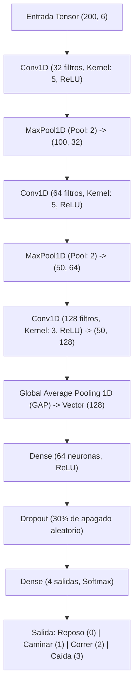

# Funcionamiento y Pipeline de Machine Learning en SupaClock (Edge HAR & Fall Detection)

Este documento detalla el diseño técnico, la arquitectura y la integración del módulo de **Reconocimiento de Actividad Humana (HAR)** y **Detección de Caídas** a bordo del dispositivo wearable *SupaClock*.

---

## 1. Entrada del Modelo y Dimensión del Bus de Datos

El modelo de Machine Learning está diseñado para clasificar actividades inerciales locales a partir de los datos crudos del sensor **IMU BMI160** (acelerómetro y giroscopio de 3 ejes).

### Flujo e Instrumentación del Bus de Datos:
1. **Muestreo de Hardware:** El IMU se muestrea a una frecuencia física de **100 Hz** en la tarea de FreeRTOS `har_task` en el Core 1.
2. **Promediado / Downsampling:** Para cumplir con la frecuencia de diseño del modelo de ML (50 Hz) y reducir el ruido de alta frecuencia, un acumulador en el firmware promedia cada 2 muestras consecutivas de los 6 ejes:
   $$\text{Aceleración promedio} = \frac{a_{t} + a_{t-1}}{2}, \quad \text{Giroscopio promedio} = \frac{g_{t} + g_{t-1}}{2}$$
3. **Escalamiento y Normalización:** Los datos se leen originalmente en formato entero de 16 bits con signo (`int16_t`). Antes de ingresar al modelo, se dividen por $32768.0$, proyectándolos al rango flotante de $[-1.0, 1.0]$.
4. **Ventana de Inferencia (Tamaño de la Ventana):** Se extraen ventanas deslizantes de **200 muestras** a 50 Hz.
   * **Duración Física:** 200 muestras / 50 Hz = **4.0 segundos** de movimiento continuo. Esto asegura capturar ciclos completos de marcha (caminar/correr) o perfiles inerciales de caídas y su posterior inmovilidad.
5. **Traslape (Overlap):** Se utiliza un traslape del **50% (100 muestras)**.
   * **Frecuencia de Inferencia:** Se ejecuta el modelo cada 100 muestras nuevas (**2.0 segundos**).
   * **Ventaja:** Cada inferencia aprovecha 2.0 segundos de datos históricos (del ciclo anterior) combinados con 2.0 segundos de datos nuevos, amortiguando transiciones abruptas y logrando continuidad temporal sin retardos de percepción en el display.

### Dimensiones de Entrada (Input Tensor Shape):
El bus de datos inercial estructurado que entra al intérprete de TensorFlow Lite Micro tiene la forma de un tensor bidimensional:
$$\text{Shape} = (200, 6) \implies 1200 \text{ elementos numéricos}$$

Las dimensiones y peso de la memoria para este bus son:
* **Datos Raw (SRAM interna):** $200 \text{ muestras} \times 6 \text{ canales} \times 2 \text{ bytes (int16)} = \mathbf{2.4\text{ KB}}$ en formato de buffer circular de enteros.
* **Datos Descuantizados (float32):** $1200 \text{ elementos} \times 4 \text{ bytes} = \mathbf{4.8\text{ KB}}$ de entrada temporal.
* **Datos Cuantizados (TFLite INT8):** $1200 \text{ elementos} \times 1 \text{ byte} = \mathbf{1.2\text{ KB}}$ pasados directamente a la primera capa convolucional del intérprete.

---

## 2. Arquitectura de la Red Convolucional (1D CNN)

El modelo es una red neuronal convolucional unidimensional secuencial optimizada para entornos embebidos (TinyML).



### Detalle de Capas y el "Por Qué" de su Configuración (Explicación para Principiantes)

Para una persona que no es experta en Inteligencia Artificial, una red neuronal puede parecer una "caja negra" mágica. Sin embargo, su lógica interna es muy intuitiva. En lugar de escribir reglas lógicas rígidas (como *"si la aceleración en Z es menor a $0.5g$ durante tanto tiempo..."*), el modelo aprende a extraer **características jerárquicas** de forma automática.

#### El Concepto de Aprendizaje Jerárquico: ¿Por qué necesitamos varias capas?
Al igual que el cerebro humano reconoce una cara detectando primero líneas simples $\to$ bordes $\to$ formas básicas (ojos, boca) $\to$ cara completa; nuestra red neuronal procesa el movimiento en tres niveles convolucionales:
1. **Nivel Bajo (Capa 1):** Detecta pequeños cambios instantáneos (micro-impactos, frenados bruscos o sacudidas rápidas).
2. **Nivel Medio (Capa 2):** Agrupa esos cambios para ver cómo se combinan a lo largo del tiempo (por ejemplo, detectar la subida de la mano seguida de una bajada).
3. **Nivel Alto (Capa 3):** Identifica el patrón de movimiento completo y complejo (la repetición rítmica de pasos o la secuencia completa de una caída).

A continuación se explica al detalle el funcionamiento e importancia de cada una de las 10 capas del modelo:

---

#### 1. Capa de Entrada (Input Layer - Shape: 200 $\times$ 6)
* **Qué recibe:** Recibe una "foto" o matriz de datos inerciales que mide **200 filas de muestras temporales** y **6 columnas de sensores** (aceleraciones $a_x, a_y, a_z$ y giros $g_x, g_y, g_z$). A 50 Hz, esta matriz representa exactamente **4.0 segundos** de movimiento.
* **El "Por Qué" de sus detalles:** 
  * Los sensores del IMU entregan valores muy grandes en enteros (por ejemplo, $16384$ para $1g$ en acelerómetro). Si alimentamos la red directamente con números tan grandes, los cálculos matemáticos colapsarían o se volverían extremadamente lentos (problema de gradiente explosivo).
  * Por eso, esta capa normaliza el bus de datos dividiendo cada valor por $32768.0$, lo que comprime toda la señal exactamente en el rango flotante de $[-1.0, 1.0]$. Esto permite que las matemáticas de las siguientes capas operen en una escala homogénea y predecible.

---

#### 2. Conv1D - Primera Convolución (32 filtros, Kernel = 5, ReLU)
* **El concepto intuitivo:** Imagina que tienes **32 plantillas o "sellos" diferentes** (filtros) que miden exactamente 5 milisegundos inerciales (0.1 segundos físicos). Esta capa desliza cada una de las 32 plantillas sobre los 4 segundos de datos inerciales. Si la señal inercial coincide con la forma de la plantilla (por ejemplo, una plantilla busca "picos de aceleración rápida hacia arriba"), la capa genera una señal fuerte. Si no coincide, genera una señal débil o nula.
* **El "Por Qué" de sus detalles:**
  * **Filtros = 32:** Significa que buscamos 32 patrones inerciales básicos diferentes en paralelo en la señal de entrada.
  * **Kernel = 5 (0.1 segundos a 50 Hz):** Se eligió 5 porque un micro-impacto o el choque inicial de un talón contra el suelo al caminar dura físicamente entre 80 y 120 milisegundos. Un kernel de tamaño 5 es la "lupa temporal" perfecta para detectar estos eventos cortos.
  * **Activación ReLU (Rectified Linear Unit):** Es un interruptor matemático simple pero potente: $f(x) = \max(0, x)$. Si la plantilla no coincide y da un valor negativo, ReLU lo convierte en un **cero absoluto (silencio)**. Si da positivo, deja pasar el valor real. Esto evita que los ruidos o vibraciones irrelevantes (negativos) se propaguen por la red y permite modelar decisiones complejas que no son líneas rectas (no lineales).

---

#### 3. MaxPooling1D - Primer Reductor de Datos (Pool = 2)
* **El concepto intuitivo:** MaxPooling divide la señal de salida del paso anterior en bloques de 2 muestras de tiempo consecutivas y se queda **únicamente con el valor más grande** de cada bloque, descartando el menor.
* **El "Por Qué" de sus detalles:**
  * Al quedarse solo con la mayor respuesta, la longitud de la señal se reduce exactamente **a la mitad** (de 200 muestras de tiempo a 100).
  * Esto tiene dos beneficios cruciales:
    1. **Velocidad:** Reduce a la mitad las operaciones matemáticas que deben hacer las siguientes capas convolucionales, lo cual es vital para que la ESP32-S3 no gaste batería de más.
    2. **Invarianza Temporal (Tolerancia a desfases):** Al sensor no le importa el milisegundo exacto en el que pisaste; solo le importa si pisaste en esa fracción de segundo. MaxPooling "suaviza" el tiempo, haciendo que el modelo sea robusto aunque el usuario camine un poco más rápido o más lento que los datos con los que se entrenó.

---

#### 4. Conv1D - Segunda Convolución (64 filtros, Kernel = 5, ReLU)
* **El concepto intuitivo:** Esta capa ya no mira los datos crudos del IMU. En su lugar, analiza las características de bajo nivel detectadas por la primera capa (las 32 formas simples) y las desliza usando **64 nuevas plantillas combinadas**.
* **El "Por Qué" de sus detalles:**
  * **Filtros = 64:** Buscamos 64 combinaciones de patrones.
  * **Kernel = 5:** Debido a que el primer MaxPooling redujo el tiempo a la mitad, un kernel de tamaño 5 en esta capa cubre el doble de tiempo físico real (0.2 segundos). Esto permite empezar a ver secuencias de movimiento (por ejemplo: detectar un "impacto" de talón seguido inmediatamente por una "inclinación de la muñeca").

---

#### 5. MaxPooling1D - Segundo Reductor de Datos (Pool = 2)
* **El concepto intuitivo:** Divide nuevamente el tiempo a la mitad (de 100 a 50 muestras de tiempo).
* **El "Por Qué" de sus detalles:**
  * Sigue simplificando y comprimiendo la señal. Al final de esta capa, los datos se han reducido de 200 muestras de tiempo a solo 50, dejando únicamente los picos máximos de características.

---

#### 6. Conv1D - Tercera Convolución (128 filtros, Kernel = 3, ReLU)
* **El concepto intuitivo:** Es la capa de convolución de mayor nivel. Analiza las combinaciones complejas a través de **128 filtros muy especializados** con un kernel de tamaño 3.
* **El "Por Qué" de sus detalles:**
  * A este nivel, debido a los dos redutores (MaxPooling) previos, un kernel de tamaño 3 cubre físicamente un tramo amplio de tiempo real ($\approx 0.24$ segundos).
  * Esta capa es capaz de extraer patrones de alta complejidad biomecánica, como la combinación exacta de giros en Z y aceleraciones verticales que diferencian de manera inequívoca el trote (alta intensidad periódica) de una caminata ordinaria.

---

#### 7. Global Average Pooling 1D (GAP - El Gran Sintetizador)
* **El concepto intuitivo:** En lugar de reducir los datos paso a paso, GAP toma las 50 muestras de tiempo restantes y **calcula el promedio matemático de activación** de cada uno de los 128 patrones detectados a lo largo de toda la ventana.
* **El "Por Qué" de sus detalles (Diferencia crítica con *Flatten*):**
  * En modelos clásicos de computadora se usa una capa llamada `Flatten` (aplanado), que estira la matriz de $(50 \times 128)$ en una larga lista de 6,400 números. Conectar eso a la siguiente capa densa requeriría más de 400,000 parámetros de memoria, lo cual saturaría la SRAM de la ESP32-S3.
  * **GAP soluciona esto:** Al promediar cada columna, entrega exactamente **128 números** (un solo promedio por patrón). Físicamente esto significa: *"No me importa en qué milisegundo exacto ocurrió el paso; solo dime qué tan activo estuvo el patrón de caminata en promedio durante estos 4 segundos"*.
  * Esto reduce los parámetros de memoria de la red en un **98%**, logrando que el modelo final sea extremadamente liviano (~58 KB) y evitando que la red neuronal "memorice" trazas específicas (previniendo el sobreajuste).

---

#### 8. Dense Layer (Capa Densa Decisora - 64 neuronas, ReLU)
* **El concepto intuitivo:** Imagina un jurado compuesto por 64 personas (neuronas). Cada persona recibe los 128 promedios calculados por GAP y los pondera con pesos diferentes según su experiencia para votar por una sospecha intermedia.
* **El "Por Qué" de sus detalles:**
  * Es la etapa donde la red combina los promedios globales de movimiento para realizar un razonamiento matemático final no lineal (usando activación ReLU para filtrar sospechas débiles).

---

#### 9. Dropout (El Entrenador Exigente - Tasa = 0.3)
* **El concepto intuitivo:** Durante el entrenamiento en la computadora, esta capa **apaga de forma aleatoria el 30% de las 64 neuronas decisoras** en cada paso de aprendizaje.
* **El "Por Qué" de sus detalles:**
  * Si no hiciéramos esto, una o dos neuronas podrían volverse "genios" que memoricen el dataset, haciendo que las otras 62 neuronas dejen de aprender.
  * Al apagar neuronas aleatoriamente, obligamos a toda la red a crear rutas alternativas y redundantes para clasificar la actividad. Así, el modelo se vuelve sumamente robusto frente a perturbaciones del sensor. Durante la ejecución en el reloj inteligente, Dropout se desactiva y todas las neuronas trabajan juntas al 100%.

---

#### 10. Capa de Salida Dense + Softmax (4 salidas)
* **Qué hace:** Toma las combinaciones del jurado y proyecta los votos finales en **4 números crudos** (uno para cada actividad). La función **Softmax** toma estos 4 números y los convierte en **porcentajes que suman exactamente 100%**.
* **El "Por Qué" de sus detalles:**
  * Permite al firmware del reloj interpretar el resultado de forma probabilística. Por ejemplo:
    $$\text{Softmax} \implies \left[\text{Reposo: } 1\%, \ \text{Caminar: } 96\%, \ \text{Correr: } 2\%, \ \text{Caída: } 1\%\right]$$
  * El firmware selecciona el estado con el porcentaje más alto (en este caso, *Caminar*) y lo reporta a la pantalla de usuario.

---

### Clases de Actividad del Modelo

La capa Softmax final clasifica las ventanas en 4 estados mutuamente excluyentes:

* **Clase 0: Reposo (`HAR_STATE_RESTING`):**
  * *Firma inercial:* Varianza muy baja en todos los ejes del acelerómetro y giroscopio. El acelerómetro mide de forma estable $1g$ (gravedad), el cual cambia de eje dependiendo de la orientación de la muñeca del usuario en reposo.
* **Clase 1: Caminar (`HAR_STATE_WALKING`):**
  * *Firma inercial:* Señal periódica cíclica de baja-media frecuencia (típicamente entre 1.0 Hz y 2.0 Hz, equivalente a 1 o 2 pasos por segundo). Las aceleraciones netas son moderadas y repetitivas.
* **Clase 2: Correr (`HAR_STATE_RUNNING`):**
  * *Firma inercial:* Señal cíclica rítmica de alta frecuencia (entre 2.5 Hz y 4.5 Hz) con altas aceleraciones de impacto vertical y giros pronunciados debido al braceo dinámico.
* **Clase 3: Caída (`HAR_STATE_FALL`):**
  * *Firma inercial:* Un patrón no periódico y violento caracterizado por tres fases consecutivas en los 4 segundos:
    1. *Fase de pérdida de peso:* Aceleración neta disminuye bruscamente hacia $0g$ (caída libre).
    2. *Fase de impacto:* Pico transitorio extremo y multidireccional de aceleración (supera los $3g$) acompañado de giros angulares caóticos y veloces.
    3. *Fase de inmovilidad:* Reposo absoluto post-impacto en una posición inercial distinta a la basal.

---

## 3. Ventajas de la CNN 1D sobre otras Arquitecturas

Para el despliegue a bordo de un reloj inteligente con restricciones de batería y memoria, la selección de la arquitectura CNN 1D ofrece importantes ventajas comparativas:

| Criterio | CNN 1D (Propuesto) | MLP (Redes Densas) | RNN / LSTM (Recurrentes) | Heurísticas basadas en Reglas |
| :--- | :--- | :--- | :--- | :--- |
| **Preservación Temporal** | **Alta.** Filtra localmente el tiempo manteniendo las relaciones espaciales del sensor. | **Baja.** Requiere "aplanar" la ventana perdiendo la secuencia inercial. | **Alta.** Retiene información temporal de forma secuencial. | **Media.** Depende del diseño manual de retardos y límites temporales. |
| **Tamaño del Modelo** | **Pequeño (~58 KB).** La compartición de pesos (kernels) aminora los parámetros. | **Grande.** El aplanamiento de entrada genera millones de conexiones densas. | **Medio.** Pesada en compuertas de control de estado. | **Extremadamente Bajo (<1 KB).** Código nativo de comparaciones simples. |
| **Uso de Memoria RAM** | **Bajo (128 KB Arena).** Aloca buffers de activación temporales y reutilizables. | **Alto.** Almacena pesos de matrices de gran tamaño en memoria de ejecución. | **Muy Alto.** Requiere almacenar en RAM arrays de celdas ocultas y cell-states. | **Despreciable (<100 Bytes).** Solo guarda acumuladores simples. |
| **Aceleración Hardware** | **Excelente.** Totalmente compatible con instrucciones SIMD del ESP32-S3 (**ESP-NN**). | **Media.** Multiplicación de matrices básica sin optimización espacial. | **Baja.** Procesamiento secuencial difícil de vectorizar por hardware. | **No aplica.** Operaciones puramente condicionales (`if/else`). |
| **Robustez ante Ruido** | **Alta.** Tolera variaciones biomecánicas del usuario y filtra movimientos casuales. | **Baja.** Tiende a sobreajustar y es muy sensible a desfases temporales. | **Alta.** Robusta frente a fluctuaciones en la señal. | **Muy Baja.** Genera falsos positivos frecuentes ante aceleraciones transitorias ordinarias. |

---

## 4. Integración y Arquitectura del Firmware

El módulo está escrito en lenguaje C y se ejecuta de forma asíncrona aprovechando la arquitectura del microcontrolador **Seeed XIAO ESP32-S3**:

1. **Aislamiento Core 1 (FreeRTOS):**
   * El ESP32-S3 cuenta con un procesador dual-core Xtensa LX7 a 240 MHz.
   * La tarea del clasificador de actividad (`har_task`) se ancla al **Core 1** con prioridad media-alta (`priority 4`).
   * **Beneficio:** Las tareas que exigen alta prioridad de comunicación y tiempo real (como la pila Bluetooth `NimBLE` y el refresco de pantalla del motor gráfico `LVGL`) corren en el **Core 0**. De esta forma, la inferencia matemática de la CNN no introduce retrasos perceptibles en la interfaz de usuario ni provoca desconexiones BLE.
2. **Uso de la Memoria PSRAM Externa:**
   * El XIAO ESP32-S3 dispone de 320 KB de SRAM interna y 8 MB de PSRAM externa octal de alta velocidad.
   * La Tensor Arena requerida por TensorFlow Lite Micro para ejecutar las activaciones intermedias del modelo (128 KB) se reserva enteramente en la PSRAM:
     ```c
     s_arena = (uint8_t *)heap_caps_aligned_alloc(16, HAR_ARENA_BYTES, MALLOC_CAP_SPIRAM);
     ```
   * **Beneficio:** Libera la preciada SRAM interna (que queda reservada para los buffers DMA de la pantalla LCD, LVGL y NimBLE), evitando fallos por falta de memoria dinámica (heap exhaustion) en tiempo de ejecución.
3. **Optimización con ESP-NN:**
   * Las operaciones de convolución de 8 bits cuantizadas se resuelven utilizando la librería optimizada de Espressif **ESP-NN**, la cual aprovecha las instrucciones SIMD (Single Instruction Multiple Data) nativas de la arquitectura Xtensa LX7. Esto reduce el tiempo de cómputo de la inferencia desde los $\sim$150 ms (en la ESP32-C3 sin aceleración) a tan solo **5-20 ms** en la ESP32-S3.
